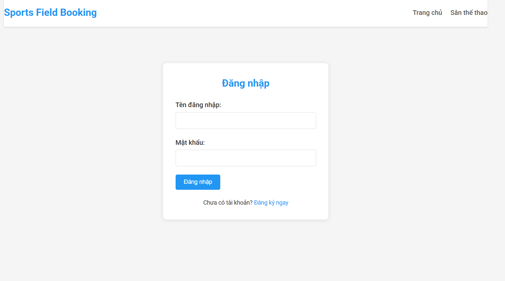
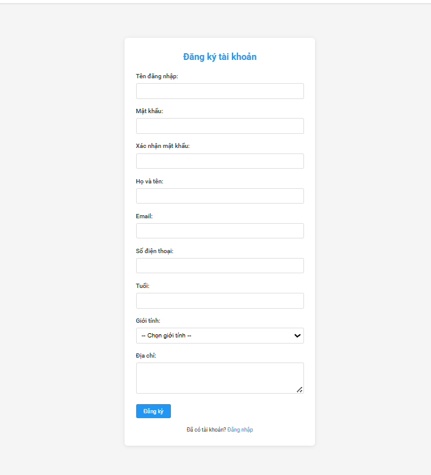
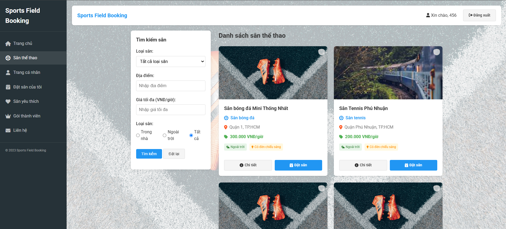
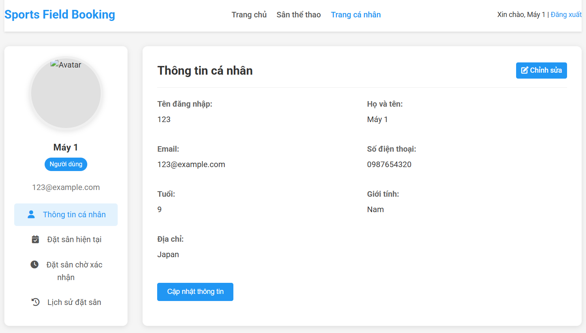
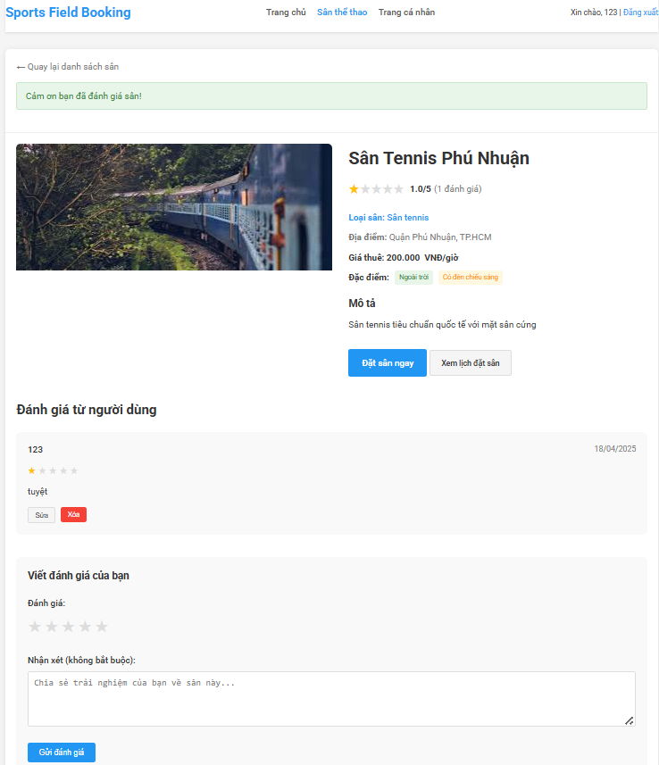

# Sports Field Booking System


Hệ thống đặt sân thể thao trực tuyến được xây dựng bằng Spring Boot, cho phép người dùng tìm kiếm, đặt và quản lý sân thể thao một cách dễ dàng và tiện lợi.

## 📋 Mục lục

- [Tổng quan](#tổng-quan)
- [Tính năng chính](#tính-năng-chính)
- [Công nghệ sử dụng](#công-nghệ-sử-dụng)
- [Cài đặt và chạy ứng dụng](#cài-đặt-và-chạy-ứng-dụng)
- [Cấu trúc dự án](#cấu-trúc-dự-án)
- [Tài khoản mặc định](#tài-khoản-mặc-định)
- [Ảnh chụp màn hình](#ảnh-chụp-màn-hình)
- [Đóng góp](#đóng-góp)
- [Giấy phép](#giấy-phép)
- [Liên hệ](#liên-hệ)

## 🌟 Tổng quan

Sports Field Booking System là một nền tảng trực tuyến giúp người dùng tìm kiếm và đặt sân thể thao phù hợp với nhu cầu của mình. Hệ thống hỗ trợ nhiều loại sân thể thao khác nhau như sân bóng đá, sân tennis, sân cầu lông, và nhiều loại sân khác. Người dùng có thể dễ dàng tìm kiếm sân theo loại, địa điểm, giá cả và các tiện ích đi kèm.

## ✨ Tính năng chính

### 👤 Quản lý người dùng
- Đăng ký tài khoản mới
- Đăng nhập/Đăng xuất
- Xem và chỉnh sửa thông tin cá nhân
- Phân quyền người dùng (Admin/User)

### 🏟️ Quản lý sân thể thao
- Xem danh sách tất cả các sân
- Tìm kiếm sân theo loại (bóng đá, tennis, cầu lông...)
- Lọc sân theo địa điểm, giá cả
- Xem chi tiết thông tin sân
- Xem đánh giá của người dùng khác

### 📅 Đặt sân
- Đặt sân theo ngày và khung giờ
- Xem lịch sử đặt sân
- Hủy đặt sân
- Thanh toán trực tuyến (thẻ tín dụng, chuyển khoản, ví điện tử, tiền mặt)

### ⭐ Đánh giá và phản hồi
- Đánh giá sân sau khi sử dụng (xếp hạng từ 1-5 sao)
- Xem đánh giá của người dùng khác
- Viết bình luận về trải nghiệm sử dụng sân

### 👨‍💼 Quản lý hệ thống (Admin)
- Quản lý thông tin người dùng
- Thêm, sửa, xóa thông tin sân thể thao
- Xác nhận, hủy, hoàn thành các đơn đặt sân
- Xem thống kê tổng quan trên trang Dashboard

## 🛠️ Công nghệ sử dụng

### Backend
- **Java 17**
- **Spring Boot 3.3.5**
- **Spring Data JPA**
- **Spring MVC**
- **Spring Security Crypto** (mã hóa mật khẩu)

### Frontend
- **JSP (Jakarta Server Pages)**
- **JSTL (Jakarta Standard Tag Library)**
- **HTML/CSS/JavaScript**
- **Bootstrap**
- **Font Awesome**

### Cơ sở dữ liệu
- **MySQL 8.0**

### Công cụ và thư viện khác
- **Maven** (quản lý dependency)
- **Tomcat** (embedded server)
- **BCrypt** (mã hóa mật khẩu)

## 🚀 Cài đặt và chạy ứng dụng

### Yêu cầu hệ thống

Trước khi chạy dự án này, hãy đảm bảo bạn đã cài đặt:

- **Java Development Kit (JDK) 17** trở lên
- **MySQL** (phiên bản 8.0 trở lên)
- **Maven** (tùy chọn, dự án đã bao gồm Maven Wrapper)

### Bước 1: Clone dự án

```bash
git clone https://github.com/yourusername/sports-field-booking-system.git
cd sports-field-booking-system
```

### Bước 2: Tạo cơ sở dữ liệu

Tạo cơ sở dữ liệu MySQL với tên `sportsfieldboookingsystem`. Bạn có thể sử dụng file `schema.sql` trong thư mục `src/main/resources` để tạo cấu trúc cơ sở dữ liệu và dữ liệu mẫu.

```bash
mysql -u root -p < src/main/resources/schema.sql
```

### Bước 3: Cấu hình application.properties

Chỉnh sửa nội dung file `application.properties` trong thư mục `src/main/resources` với nội dung sau:

```properties
spring.application.name=sportsfieldboookingsystem

# View resolve
spring.mvc.view.prefix=/WEB-INF/views/
spring.mvc.view.suffix=.jsp

# Database config
spring.datasource.url=jdbc:mysql://localhost:3306/sportsfieldboookingsystem
spring.datasource.username=<your_db_username> # Thay thế bằng tên người dùng của bạn trên MySQL
spring.datasource.password=<your_db_password> # Thay thế bằng mật khẩu của bạn trên MySQL

# JPA config
spring.jpa.database-platform=org.hibernate.dialect.MySQLDialect
spring.jpa.hibernate.ddl-auto=update
spring.jpa.properties.hibernate.show_sql=true
spring.jpa.properties.hibernate.format_sql=true
```

Thay thế `<your_db_username>` và `<your_db_password>` bằng thông tin đăng nhập MySQL của bạn.

### Bước 4: Chạy ứng dụng

#### Trên Windows:

```bash
mvnw.cmd spring-boot:run
```

#### Trên Linux/macOS:

```bash
./mvnw spring-boot:run
```

Ứng dụng sẽ chạy trên cổng 8080 theo mặc định. Bạn có thể truy cập ứng dụng tại `http://localhost:8080`.

## 📁 Cấu trúc dự án

```
src/main/java/com/sports/sportsfieldboookingsystem/
├── config/                  # Cấu hình ứng dụng
├── controllers/             # Xử lý các request HTTP
├── handlers/                # Các utility class
├── models/                  # Entity JPA
├── repositories/            # Repository để truy vấn dữ liệu
├── services/                # Business logic
└── SportsfieldboookingsystemApplication.java  # Main class

src/main/resources/
├── static/                  # Tài nguyên tĩnh (CSS, JS, images)
└── schema.sql               # Script tạo cơ sở dữ liệu

src/main/webapp/WEB-INF/views/
├── admin/                   # Giao diện quản trị
└── ...                      # Các trang JSP khác
```

## 👤 Tài khoản mặc định

Hệ thống tự động tạo các tài khoản admin mặc định khi khởi động:

### Admin
- **Username**: admin
- **Password**: admin123
- **Email**: admin@example.com

### Admin 2
- **Username**: admin2
- **Password**: admin123
- **Email**: admin2@example.com

## 🖼️ Ảnh chụp màn hình

### Trang chủ


### Trang chủ (phiên bản 2)


### Đăng nhập


### Đăng ký


### Danh sách sân


### Trang cá nhân


### Đánh giá và phản hồi


## 📄 Tài liệu API Swagger
Thật ra mới làm có 1 api thôi test swagger
Sau khi chạy ứng dụng, bạn có thể truy cập tài liệu API Swagger tại địa chỉ:
http://localhost:8080/swagger-ui/index.html
hoặc http://localhost:8080/v3/api-docs

## 🤝 Đóng góp

Chúng tôi rất hoan nghênh mọi đóng góp để cải thiện dự án. Nếu bạn muốn đóng góp, vui lòng:

1. Fork dự án
2. Tạo nhánh tính năng (`git checkout -b feature/amazing-feature`)
3. Commit các thay đổi (`git commit -m 'Add some amazing feature'`)
4. Push lên nhánh (`git push origin feature/amazing-feature`)
5. Mở Pull Request

## 📄 Giấy phép

Dự án này được phân phối dưới giấy phép MIT. Xem file `LICENSE` để biết thêm chi tiết.

## 📞 Liên hệ

Nếu bạn có bất kỳ câu hỏi hoặc góp ý nào, vui lòng liên hệ với chúng tôi qua email: example@example.com

---

© 2023 Sports Field Booking System. All rights reserved.